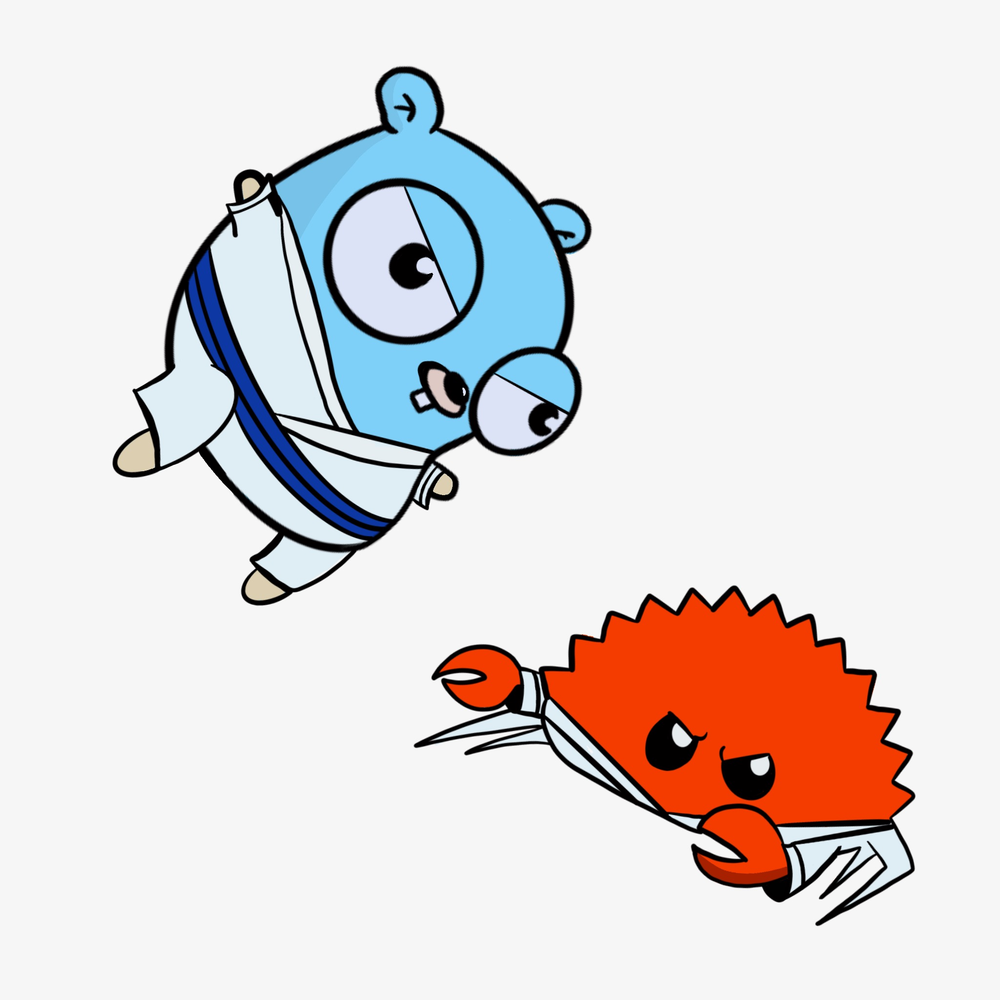

## Go Jitsu 

* not related to the project, but it's a fun rivalry ! 

- This is my attempt at a Data Science portfolio project
- I want to get better at go, so I will try to start scraping with go but if i run 
into too many roadblocks I will switch to python or js 
- I will see if it is possible to create models / images in go but will probably stick with R 
if nothing else for Rmd which will make writing a paper much easier. 
- The goal of this is to analyze as much data as I can scrape on BJJ competitors such as 
weight, win loss ration, submission variation, etc.. and see what patterns emerge. 

### step 1 : data collection 

- For the data scraping I have two main options 
- **Go** 
- **Python** 
- I want to use go as it seems like one of the better new languages, I really like 
its simplicity and speed, how one isn't sacrificed for the other.
- if I can't get go working I can script something in python / awk rather easily but it will
be a less academic endeavor 

- the website of choice is BJJ heroes which lists all competitors with their records 
- [list](https://www.bjjheroes.com/a-z-bjj-fighters-list) will be the first website scraped to get all names 
- then it will have to follow each link and take data from individual competitors and amass a csv of fighters with their information. 

### step 2 : data cleaning / analysis 

- this step will almost exclusively be done in R as it is the language I have the most DS 
experience in. I will try to organize a proper "tidy" data frame and then create some simple 
graphs, etc... 

### step 3 : presentation / paper 

- once I have the data cleaned, graphed, and hopefully modeled, I will see if I can make any novel observations and then write up a short paper in Rmd and export to pdf. 
- this will be my portfolio piece that I hope gives some unique insight into BJJ
